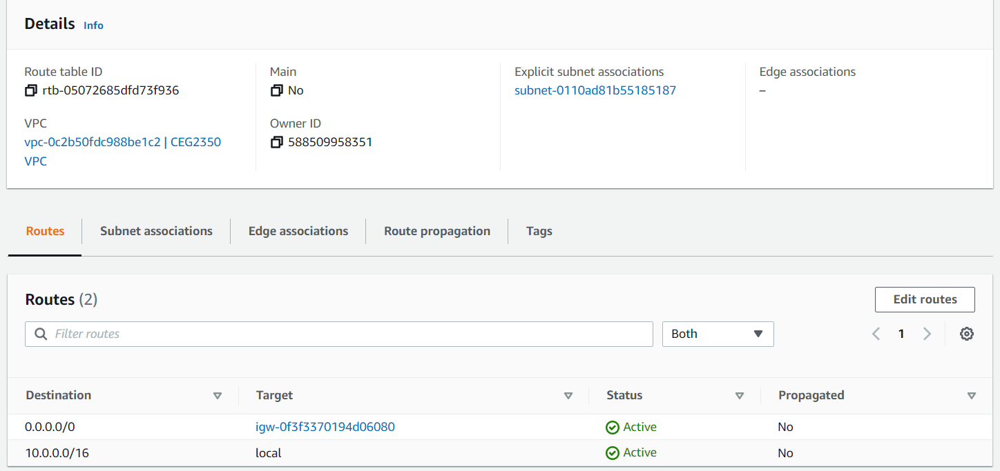

# AWS - VPC & EC2

The purpose of this chunk is to:
- Play around in areas of AWS (specifically the VPC & EC2 resource menus)
- Understand resources / configurations needed to build a cloud network
- Understand resources / configurations needed to reserve & build instances

Need to remember networking 101?  Check out [some other course notes](https://github.com/pattonsgirl/CEG2410/blob/main/LectureNotes/Week03-Networking.md)

This is a fairly dry, info only page.  Companion drawings are in the OneNote Notebook linked on Pilot.

## AWS VPC

AWS [Virtual Private Cloud (VPC)](https://docs.aws.amazon.com/vpc/latest/userguide/what-is-amazon-vpc.html) allows you to launch resources to a network you define.  The VPC menu in AWS focuses on the network resources in the VPC, while the EC2 menu (discussed later) focuses on instances.

Every VPC must have one or more [subnets](https://docs.aws.amazon.com/vpc/latest/userguide/configure-subnets.html), each of which contains a range of IP addresses in your VPC.  The first 4 and last 1 IPv4 address in each subnet cannot be used.  For example, in a subnet with CIDR block of 10.0.0.0/24:
- 10.0.0.0: Network address.
- 10.0.0.1: Reserved by AWS for the VPC router.
- 10.0.0.2: Reserved by AWS. The IP address of the DNS server is the base of the VPC network range plus two. For VPCs with multiple CIDR blocks, the IP address of the DNS server is located in the primary CIDR. AWS reserves the base of each subnet range plus two for all CIDR blocks in the VPC. For more information, see Amazon DNS server.
- 10.0.0.3: Reserved by AWS for future use.
- 10.0.0.255: Network broadcast address. AWS does not support broadcast in a VPC, therefore we reserve this address. 

Each subnet is assigned a [routing table](https://docs.aws.amazon.com/vpc/latest/userguide/VPC_Route_Tables.html#subnet-route-tables) which defines traffic rules for network traffic within the subnet.  In general, there are two rules - one for traffic internal to the VPC, and one for traffic destined for outside the VPC - in other words, what traffic needs to go through the **internet gateway**.  

An [internet gateway](https://docs.aws.amazon.com/vpc/latest/userguide/VPC_Internet_Gateway.html) allows communication between your VPC and the internet.  An internet gateway provides a target in your VPC route tables for internet-routable traffic. 

### Security Configurations

[Network access control lists (Network ACLs)](https://docs.aws.amazon.com/vpc/latest/userguide/vpc-network-acls.html) allow or deny specific inbound or outbound traffic at the **subnet** level.  Your VPC automatically comes with a modifiable default network ACL. By **default**, it **allows all inbound and outbound IPv4 traffic** and, if applicable, IPv6 traffic.

[Security groups](https://docs.aws.amazon.com/vpc/latest/userguide/VPC_SecurityGroups.html) control the traffic that is allowed to reach and leave the resources that it is associated with.  When you first **create** a security group, it has **no inbound rules**. Therefore, no inbound traffic is allowed until you add inbound rules to the security group.

AWS has made a happy [chart of comparison between Security Groups & Network ACLs](https://docs.aws.amazon.com/vpc/latest/userguide/VPC_Security.html#VPC_Security_Comparison)

### Public vs Private Subnets

| Public subnet | Private subnet |
| -- | -- |
| route to Internet Gateway | no route to Internet Gateway | 
| Internet addressable resources (i.e. resources with EIP associated) | resources only have private IP on subnet | 
| public NAT Gateway (with EIP) would be attached if private subnet needs Internet access | route table would define outbound traffic goes to NAT Gateway device on public subnet |

Things that can create traps:
1. route table for either subnet defines traffic local to subnet, but not traffic to other subnets.
    - for example: VPC is 10.0.0.0/16, public subnet is 10.0.0.0/24, private subnet is 10.0.1.0/24, in order to enable communication between the two (if you don't want the whole VPC) the local route needs to allow 10.0.0.0/23 (or 10.0.1.0/23 would state the same block)
2. Security Groups need to allow port access if there is a restricted ruleset.
    - for example: VPC is 10.0.0.0/16, public subnet is 10.0.0.0/24, private subnet is 10.0.1.0/24, in order to enable SSH (port 22) communication between the two (if you don't want the whole VPC) there needs to be a rule to allow 10.0.0.0/23 (or 10.0.1.0/23 would state the same block) to use SSH
3. Network ACL rules
    - see examples above

Resources:
- [devopsmania - Difference between public and private subnets](https://devopsmania.com/the-difference-between-public-and-private-subnets-in-amazon-vpc/)
- [1cloudhub - create VPC with public & private subnet](https://www.1cloudhub.com/aws-vpc-101-creation-of-public-subnet-and-private-subnet-in-vpc-and-test-connectivity)
- [AWS - VPC with public and private subnets (NAT)](https://docs.aws.amazon.com/vpc/latest/userguide/VPC_Scenario2.html)

### NAT Gateways

A NAT gateway is a Network Address Translation (NAT) service. You can use a NAT gateway so that instances in a private subnet can connect to services outside your VPC (instance updates, installations, etc.) but external services cannot initiate a connection with those instances (i.e. you cannot directly `ssh` to them from your system because they are not publicly accessible, but instances inside the VPC could be used to `ssh` within the private network).

For this course, we will utilize **public NAT gateways**.  **private** NAT gateways could be used to connect to other VPCs.  A *public* NAT gateway allows instances in private subnets can connect to the internet through a public NAT gateway, but cannot receive unsolicited inbound connections from the internet. 

We will be [using a NAT gateway to allow instances on a private subnet internet access](https://docs.aws.amazon.com/vpc/latest/userguide/nat-gateway-scenarios.html#public-nat-internet-access)
1. You create a public NAT gateway in a public subnet and must associate an elastic IP address with the NAT gateway at creation. 
2. You route traffic from the NAT gateway to the internet gateway for the VPC.
3. The private subnet has a route rule for external traffic to go to the NAT gateway device (which will have a private IP on the public subnet) 

Network security & NAT gateways:
- You cannot associate a security group with a NAT gateway. You can associate security groups with your instances to control inbound and outbound traffic.
- You can use a network ACL to control the traffic to and from the subnet for your NAT gateway. NAT gateways use ports 1024–65535. 

When you provision a NAT gateway, you are charged for each hour that your NAT gateway is available and each Gigabyte of data that it processes.  [Play with the calculator](https://aws.amazon.com/vpc/pricing/)

[NAT Gateway vs NAT instance](https://www.tinystacks.com/blog-post/aws-cost-optimization-nat-instances-vs-nat-gateways/) - there are some cost saving arguments here - this article dives into a bit on managing an instance for NAT versus using the AWS gateway device and pros and cons of each.

Resources:
- [AWS NAT Gateway - Access the internet from a private subnet](https://docs.aws.amazon.com/vpc/latest/userguide/nat-gateway-scenarios.html)

### IP Addressing

An [Elastic IP Address (EIP)](https://docs.aws.amazon.com/AWSEC2/latest/UserGuide/elastic-ip-addresses-eip.html) is a static IPv4 address designed for dynamic cloud computing. An Elastic IP address is allocated to your AWS account, and is yours until you release it.  By default, all AWS accounts are limited to **five (5) Elastic IP addresses per Region**.  Once an EIP is reserved, you can [associate it with an instance or network interface](https://docs.aws.amazon.com/AWSEC2/latest/UserGuide/elastic-ip-addresses-eip.html#using-instance-addressing-eips-associating)

An Elastic IP address doesn’t incur charges as long as all the following conditions are true:
- The Elastic IP address is associated with an EC2 instance.
- The instance associated with the Elastic IP address is running.
- The instance has only one Elastic IP address attached to it.
- The Elastic IP address is associated with an attached network interface.

A reserved but "unused" EIP will cost [$0.005 per hour](https://aws.amazon.com/ec2/pricing/on-demand/#Elastic_IP_Addresses)

As an alternative to an EIP, AWS can assign [public IP addresses](https://docs.aws.amazon.com/AWSEC2/latest/UserGuide/using-instance-addressing.html#concepts-public-addresses) by default if the subnet in the VPC is so configured.  For learning purposes, I recommend *against* having AWS assign a public IP address to instances, and instead reserve and associate an EIP.  AWS will release the public IP address under any of the following conditions:
- When instance is stopped, hibernated, or terminated. Your stopped or hibernated instance receives a new public IP address when it is started.
- When an Elastic IP address is associated with the instance. When you disassociate the Elastic IP address from your instance, it receives a new public IP address.
- If the public IP address of your instance in a VPC has been released, it will not receive a new one if there is more than one network interface attached to your instance.
- If your instance's public IP address is released while it has a secondary private IP address that is associated with an Elastic IP address, the instance does not receive a new public IP address.

## AWS EC2

AWS [Elastic Cloud Compute (EC2)](https://docs.aws.amazon.com/AWSEC2/latest/UserGuide/concepts.html) provides scalable computing in the cloud.  Note that VPC, EIP, Security Groups, etc. are all a part of the EC2 tool suite.  Key features:
- [**instances**](https://docs.aws.amazon.com/AWSEC2/latest/UserGuide/Instances.html) - Virtual computing environments
- [**Amazon Machine Images (AMIs)**](https://docs.aws.amazon.com/AWSEC2/latest/UserGuide/AMIs.html) - Preconfigured templates for your instances that package the bits you need for your server (including the operating system and additional software)
- [**instance types**](https://docs.aws.amazon.com/AWSEC2/latest/UserGuide/instance-types.html) - Various configurations of CPU, memory, storage, and networking capacity for your instances
    - Available instance types will vary by region
    - Fun note, [Mac is now an option](https://docs.aws.amazon.com/AWSEC2/latest/UserGuide/ec2-mac-instances.html) but not available to Education accounts
- [**key pairs**](https://docs.aws.amazon.com/AWSEC2/latest/UserGuide/ec2-key-pairs.html) - Secure login information for instances. AWS stores the public key, and you store the private key in a secure place
- [**Elastic Block Store (EBS) volumes**](https://docs.aws.amazon.com/AWSEC2/latest/UserGuide/AmazonEBS.html) - persistent data storage
- [**Regions & Availability Zones**](https://aws.amazon.com/about-aws/global-infrastructure/regions_az/) - multiple physical locations for instances & EBS volumes
    - For this course, we are using `us-east-1` aka. N. Virginia.  
        - Availability Zones: 6
        - Local Zones: 12 
        - Wavelength Zones: 8
    - **Region** are a physical location around the world where AWS clusters data centers. Each group of logical data centers is an Availability Zone.
    - **Availability Zone (AZ)** is one or more discrete data centers with redundant power, networking, and connectivity in an AWS Region.  Each region has min of 3 AZs
    - *Local Zones* place compute, storage, database, and other select AWS services closer to end-users (think media delivery & gaming).
    - *Wavelength* enables developers to build applications that deliver single-digit millisecond latencies to mobile devices and end-users (think telecommunications & cellular).
- [**tags**](https://docs.aws.amazon.com/AWSEC2/latest/UserGuide/Using_Tags.html) - metadata for resources

## Other Interesting Things

- [Visually Create a VPC](https://aws.amazon.com/blogs/aws/new-visualize-your-vpc-resources-from-amazon-vpc-creation-experience/)

## Security Best Practices

Security Groups & Network ACLs manage network firewalls within a VPC, but there is more to secure than firewalls for users, tools, etc. managed within an AWS account.

- [AWS Startup Security Baseline](https://docs.aws.amazon.com/prescriptive-guidance/latest/aws-startup-security-baseline/welcome.html)

