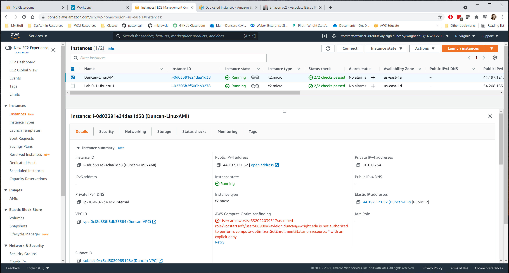

# Project 3 - Manual VPC & EC2

**Due:** See Pilot, 11:59 PM. Late policy: 2-hour grace period, then -10% per day for up to 3 days. Work committed after that is not graded.

## Objectives:

- Understand and build a private cloud network
- Understand and build an EC2 instance
- Install docker per AMI instructions
- Test and prove that your network and instance work as configured

## Assignment Notes

For this project you need access to your AWS "console". Return to the AWS Learner Lab page and click "Start Lab".  **Once the icon next to "AWS" is green (or timer countdown begins), click "AWS" to open the console.**

### Where your work goes

In your **aws** repository (`ceg3120-aws-lastname-f26`) - not your basics repository - create a **top-level** folder named exactly `AWS-Manual` containing:

- `README.md` - named exactly this, so GitHub displays it when someone opens the folder. Do your documentation work here.
- `images/` - your screenshots

Work on your repository's default branch (`main`). I recommend having your repo cloned to a desktop OS where you can access VSCode - markdown preview is super helpful.

### Write about *your* build

- Document what **you** built, with your actual values: your names, your IPs, your AMI ID, your key pair, your commands. Don't leave placeholders like `YOURLASTNAME`, `ami-xxxxxxxx`, `/path/to/your-key.pem`, or `<YOUR_ELASTIC_IP>`.
- Everything you document must match what you built - instance type, key pair name, AMI, and IPs. Your screenshots will be compared with your write-up.
- **Do not leave project task text in your documentation.** It muddles what your work was versus what the assignment tasking is, and is a 5% formatting deduction. Section headings like "Security Group" are fine; pasting the instruction bullets or prompts ("Allow SSH from a set of trusted source networks including...") is not. Answer each prompt in your own words instead.

### Partial credit for unfinished steps

If you fail to complete a portion of the project, note where you got stuck in your implementation. You may leave notes that show research into how next steps should be configured, which can earn **up to half** of that item's points - **as long as you clearly label them as research** and keep them separate from what you implemented and tested. Generic steps copied from a guide and presented as if you performed them are graded as research.

### Hints / useful notes
- It will be handy, but not necessary, to compare / contrast the resources you are making with the working "stack" you have. That stack is based on a template, and that template defined all of these resources - and worked.
- When asked to create "tags", you want to make a **`Name`** Key and then write the name in the value field. Sometimes the "Name" Key will be auto-filled for you. Sometimes not.
- If you get to a point where you need to start over, carefully go through and delete the resources you have already created.
  1. This is good maintenance. Leaving behind junk is frowned upon in any industry
  2. This will keep you from running resources you can be charged for (like unused instances and elastic IPs)
  3. Remember there is a cap - usually of 5 - of how many of a resource you can have at once.
- **If you rebuild a resource, retake its screenshot.** Screenshots must show your final configuration.
- If you get a capacity error for an instance type in an Availability Zone, try another zone or wait - it usually clears within an hour - and tell the instructor if it persists.
- **If an instruction doesn't make sense or doesn't work, ask before the deadline.**

### Formatting

Your README should be easy to read on GitHub: headings for each part and step, lists, code formatting for commands, file names, and IPs (`` `ssh -i key.pem ubuntu@1.2.3.4` `` or fenced code blocks), and tables that render. Poor formatting is up to a 10% deduction, scaled by severity - 10% if the document is illegible.

### Screenshots and images

Every screenshot must be **embedded** so it displays in your README on GitHub - not just uploaded to the repo. Use:
```

```


- Use relative paths (`images/vpc.png`), and match the filename's capitalization exactly - GitHub is case sensitive.
- Avoid spaces in filenames. If a name has spaces, wrap the path in angle brackets: ``.
- Each screenshot should show the **saved** configuration (the resource's details or rules tab), not an edit or create page, and every column the step asks about (for rules, include the **Source** / **Destination** column).
- After you push, open your README on GitHub and confirm every image appears.

## Part 1 - Build a VPC

For each step below, provide 
   - a description of what the resource does (what is its role).
   - responses to additional requests for information in any step.
   - a screenshot that shows the resource has been created according to specification  
   
You may add whatever additional notes you would like. Getting a good screenshot can be done by clicking on the resource and showing configurations in the details menu.

1. Create a **VPC**
   - Tag the "Name" with "YOURLASTNAME-VPC"
   - Specify a CIDR block of `192.168.0.0/23`

2. Create a **Subnet**
   - Tag the "Name" with "YOURLASTNAME-Subnet"
   - Reserve `192.168.0.0 - 192.168.0.255` for use on this subnet
   - Attach it to your VPC
   - Document **both**:
     - the reserved block for the subnet (in CIDR notation)
     - the remaining block(s) still available in the VPC (in CIDR notation)

3. Create an **Internet Gateway**
   - Tag the "Name" with "YOURLASTNAME-gw"
   - Attach it to your VPC

4. Create a **Route Table**
   - Tag the "Name" with "YOURLASTNAME-rt"
   - Attach it to your VPC
   - Associate it with your subnet
   - Add a routing table rule that sends traffic to destinations external to your subnet CIDR block to your internet gateway
   - Screenshot should show both the routes and the subnet association

5. Create a **Security Group**
   - Tag the "Name" with "YOURLASTNAME-sg"
   - Attach it to your VPC
   - Allow SSH **and** ICMP from each trusted source network:
     - Your home / where you usually connect to your instances from - a single address, `x.x.x.x/32`
     - Wright State (addresses in CIDR block `130.108.0.0/16`)
     - Instances within the VPC - the VPC CIDR `192.168.0.0/23` (not just the subnet's `/24`)
   - For ICMP, use type **All ICMP - IPv4** (an "Echo Reply" rule does not let others ping you)
   - Allow HTTP from any source
   - Do not allow SSH or ICMP from `0.0.0.0/0`
   - Make sure screenshot includes the content of the Inbound rules, **including the Source column**

6. Modify or create a **Network ACL**
   - Tag the "Name" with "YOURLASTNAME-nacl"
   - Affirm association or associate resource with the subnet - the NACL in your screenshots must be the one associated with your subnet
   - Verify that for Inbound & Outbound there is a rule that `Allow`s any IP (v4 only is sufficient) on all ports
     - If this rule does not exist, you'll need to create it. Created Network ACL's are `Deny` all traffic on all ports, Inbound and Outbound, by default.
   - NACL rules are evaluated **lowest rule number first**, and the first match wins. Number your deny rules **below** your allow rules (e.g. deny #90, allow #100), or they never apply.
   - Deny inbound SSH (TCP port 22) from `107.23.4.178/32` (this is another AWS instance I have in another class)
   - Deny outbound connections on any port to [wttr.in](https://wttr.in/)
     - NACL rules need an IP, not a hostname. Look it up with `dig +short wttr.in` (or `nslookup wttr.in`) and deny that address as a `/32`.
   - Make sure screenshot includes content of the saved Inbound and Outbound rules

7. Identify OR create a **Key Pair**
   - Describe what a key pair is for.
   - Document how the public and private keys of a key pair in AWS are stored and made usable to connect to the instance.
   - Include a screenshot of your key pair in the EC2 console (EC2 → Key Pairs).
   - **Never commit your private key (`.pem`) to a repository**, even a private one - add `*.pem` to your `.gitignore`.

8. Reserve an **Elastic IP address**. 
   - Tag the "Name" with "YOURLASTNAME-EIP". 
   - Document the difference between an Elastic IP and a Public IP - including what happens to each when an instance is stopped and started.
   - Screenshot should show the address and its Name tag.

## Part 2 - EC2 Instance Creation

This part will focus on configuring an instance in your VPC.

For each step below, provide a description of steps to complete the tasks (screenshots not required except where noted) and any additional documentation required by the step. Steps should say what you clicked or selected, not just list the final settings.

Note: these steps are ordered based on the "Launch Instances" wizard.

1. Create a new **Instance**. Describe what an instance is, document how-to launch a new one, and document the following information about the instance **you** built:
   - AMI selected - AMI id **and** OS with version (e.g. `ami-0123456789abcdef0`, Ubuntu Server 24.04 LTS)
   - default username of the instance type selected
   - instance type selected 
   - keypair selected (by name)
   - describe why you **need** to select a keypair
   - the how-to launch an instance instructions should include coverage on how-to:
      - Attach the instance to your subnet within your VPC
      - Associate your security group, "YOURLASTNAME-sg" to your instance.
      - Attach a volume to your instance. 
      - Tag your instance with a "Name" of "YOURLASTNAME-instance". 
2. Document the steps to associate the Elastic IP with your instance.
3. Create a **screenshot of your instance details** after instance has been launched and add it to your project write up. It should show the instance's Name, type, VPC, subnet, private IP, and Elastic IP.

## Part 3 - Instance Configuration

This part will focus on configurations and tests once you `ssh` in to your instance.

For each step below, provide a description of steps to complete the tasks - the **actual commands you ran** - and any additional documentation required by the step.

1. `ssh` in to your instance. Document the command you used, with your key file and Elastic IP.
2. Change the hostname to "YOURLASTNAME-AMI" where YOURLASTNAME is your last name and where AMI is some identifier of the AMI you chose (e.g. `Duncan-Ubuntu24`, `Duncan-AL2023`). Document the commands you ran.
   - Notes on changing a system hostname: 
      1. It is wise to copy config files you are about to change to filename.old For `/etc/hostname`, for example, I would first copy the current `hostname` file to `/etc/hostname.old`
      2. You should not change permissions on any files you are modifying. They are system config files. You may need to access them with administrative privileges.
      3. Use `hostnamectl set-hostname` so the change persists after a reboot - `sudo hostname <name>` alone is lost on reboot.
      4. Your prompt is set when your shell starts. Log out and back in (or run `exec bash`) to see the new hostname in the prompt.
      5. Here is a helpful resource: https://www.tecmint.com/set-hostname-permanently-in-linux/ I did not modify `/etc/hosts` on mine - do so or not as you wish.
3. Create a **screenshot of your `ssh` connection to your instance** and add it to your project write up - make sure it shows your new hostname in the CLI prompt. (Not a reused instance-details screenshot.)
4. **Test your Security Group and Network ACL.** For each test, show the command, where you ran it from, and the result (a screenshot or a code block of the output), and say whether the result is what your rules should produce:
   - **Security group - allowed:** `ping` and `ssh` to your Elastic IP from your home or campus network succeed.
   - **Security group - blocked:** the same `ping` from a network that is **not** in your rules (e.g. a phone hotspot) times out. Tests run only from inside the instance don't prove the security group - inbound rules are tested from outside.
   - **Security group - HTTP:** start a web server on the instance (e.g. `sudo python3 -m http.server 80`), request `http://<Elastic IP>` from your own computer, and show the `200 OK` (and the server's log line). A "connection refused" means the security group let you through but nothing was listening on port 80. Stop the server when done.
   - **Network ACL - outbound:** from the instance, `curl -m 5 wttr.in` times out while `curl -I http://example.com` returns `200 OK`. If `curl wttr.in` prints a forecast, your deny rule isn't working.
   - **Network ACL - inbound:** you can't originate traffic from `107.23.4.178`, so your NACL inbound rules screenshot is the proof for this rule.
5. Install `docker` per the **official instructions for the AMI you chose** (Docker's docs for Ubuntu, or the AWS docs for Amazon Linux - steps for a different distribution won't work). Then:
   - Document the commands you ran, including adding your user to the `docker` group (`sudo usermod -aG docker <user>`) and logging out and back in.
   - Prove it works **without `sudo`**: show the output of `docker run hello-world` (screenshot or code block). Saying "it worked" isn't proof.

## Commits, Sources, and AI

- **Commit as you work.** The project should be built up over **multiple small commits**, with messages that say what changed (e.g. "Add security group rules and screenshot"). One or two commits for the whole project, or messages like "update", "fixes", or "complete", lose points.
- **Cite your sources.** Cite every source you use - documentation, tutorials, forums, and AI tools - in a Sources section at the end of your README, and say what you used each one for. A submission with no citations loses points.
- **Your work must be your own and must describe what you built.** Submissions that appear AI-generated, or that describe work you didn't do, are held at 0 until you meet with the instructor.

## Submission

1. Commit and push your changes to your repository. Verify that these changes show in your course repository, https://github.com/WSU-kduncan/ceg3120-aws-lastname-f26

   - Your `AWS-Manual/` folder should contain:
     - `README.md`
     - `images/` with your screenshots
   - Open `AWS-Manual/README.md` on GitHub and confirm every screenshot displays.

2. In Pilot, paste the link to your project folder. Sample link: https://github.com/WSU-kduncan/ceg3120-aws-lastname-f26/blob/main/AWS-Manual/README.md

3. You may delete all created resources once done to save monies. No really, trash it - especially the instance and disassociate and release the elastic IP.  If I have questions about your work, your documentation should be good enough to quickly rebuild.

## Rubric

[Link to Rubric](Rubric.md)
