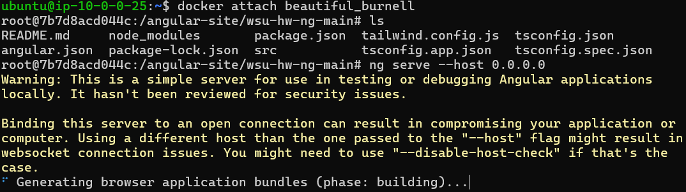

# FAQ Guide for Projects 4 & 5

Goal of this guide is to track errors as they crop up and recommended solutions.

# Docker

## Permission denied while trying to connect to the Docker daemon socket
```
bob@Duncan-Dell:~$ docker run -it ubuntu bash
docker: permission denied while trying to connect to the Docker daemon socket at unix:///var/run/docker.sock: Post "http://%2Fvar%2Frun%2Fdocker.sock/v1.24/containers/create": dial unix /var/run/docker.sock: connect: permission denied.
```

### Reason

> The Docker daemon binds to a Unix socket, not a TCP port. By default it's the root user that owns the Unix socket, and other users can only access it using sudo. The Docker daemon always runs as the root user.

> If you don't want to preface the docker command with sudo, create a Unix group called docker and add users to it. When the Docker daemon starts, it creates a Unix socket accessible by members of the docker group. On some Linux distributions, the system automatically creates this group when installing Docker Engine using a package manager. In that case, there is no need for you to manually create the group.

[See all notes, including security concerns, here](https://docs.docker.com/engine/install/linux-postinstall/)

### Solution
```
 sudo usermod -aG docker $USER
```

## Cannot connect to docker daemon
```
# Error:
Cannot connect to the Docker daemon at unix:///var/run/docker.sock. Is the docker daemon running?
```
### Reason
Usually a problem for Windows users who need to install Docker Desktop.  Docker Desktop must be running for `docker` commands
to work in WSL2

### Solution
Start Docker Desktop

## bind for port in use
Sample command:
```
docker run -d -p 80:80 --name webserver httpd
```
```
# Container error
docker: Error response from daemon: driver failed programming external connectivity on endpoint webserver 
(bd57efb73c738e3b271db180ffbee0a56cae86c8193242fbc02ea805101df21e): Error starting userland proxy: Bind for 0.0.0.0:80: 
unexpected error (Failure EADDRINUSE).
```
### Reason
Multiple containers cannot bind to the same host port.  In this case, the user ran another container that bound to host 
port 80, and running this container also with host port 80 causes the error.  An exited container will still have the host port reserved

### Solution
- View all containers, even exited containers:
  - `docker ps -a`
- Remove containers that bind to the host port you are attempting to bind to
  - `docker rm container_id_or_name`

## Angular application hangs during build



### Reason

A 1 CPU core and 1 GB RAM system is insufficient to run the processes required by the application in the container

### Solution

Build an EC2 instance with 2+ CPU cores and 2+ GB RAM.  Keep an eye on cost estimates to pick a reasonable solution.  Would also recommend 30+ GB of storage.

# GitHub Actions

# Webhooks
